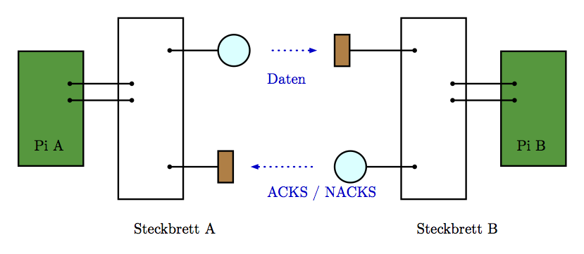
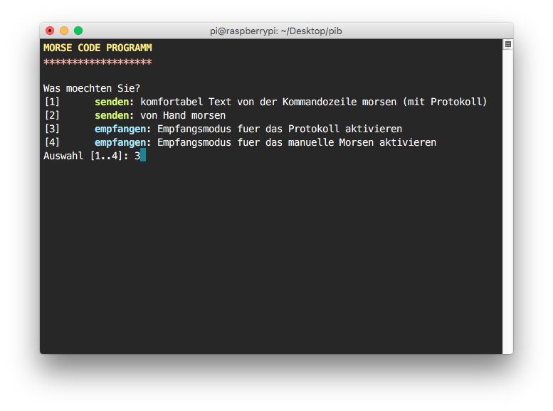

# Morsecode
## Raspberry Pis unterhalten sich mittels Morsecode

Schülerinnen und Schüler können mit dem Programm erfahren, wie der Kommunikationsaustausch mit dem Morsecode funktioniert. So können Unterrichtsinhalte zur 
* Kodierung
* Ziele der Kommunikation
* Paketbasierte Kommunikation
* Protokollbasierte Kommunikation (angelehnt an TCP/IP: Aufbau, Checksummen, Paketreihenfolge)
* Verschlüsselung / sicherer Kommunikationsaustausch

umgesetzt werden. Derzeit funktioniert der Kommunikationsaustausch nur unidirektional (Pi A sendet etwas an Pi B, Pi B sendet ACKs / NACKs zur Bestätigung / Ablehnung der Pakete). Diese Entscheidung wurde aus Gründen der Komplexität getroffen.

### Voraussetzungen
Es sind nur wenige Voraussetzungen nötig. Python ist bereits installiert.

#### Hardware

* Zwei Raspberry Pis 
* Auf beiden Seiten: 
  * Diode zum Blinken (angeschlossen am Steckbrett)
  * Phototransistor zum Empfangen (angeschlossen am Steckbrett)

#### Einstellungen des Programms

In der Datei `pi_a/config_pins.py` (bzw.  `pi_b/config_pins.py`) muss auf beiden Seiten der Pin für Diode (*senden*) und Phototransistor (*empfangen*) eingestellt werden.

### Starten

Am Raspberry Pi müssen dafür die Python-Dateien installiert werden. Dann erfolgt der Aufruf des Programms durch

    python main.py
    
Es zeigt sich das folgende Fenster.

Weitere Erklärungen finden sich in der Datei  `readme/programmablauf_bebildert/ablauf.pdf`.

#### Testen

Mit dem Skript `test_abstand/abstandstest.py` kann der Abstand der Pis angepasst werden (zuvor Pins in `test_abstand/config_pins_abstand.py` einstellen!), sodass die Kommunikation funktioniert. In der Praxis ist ein Abstand von 4 bis 5 cm möglich (je nach Helligkeit der Dioden).
