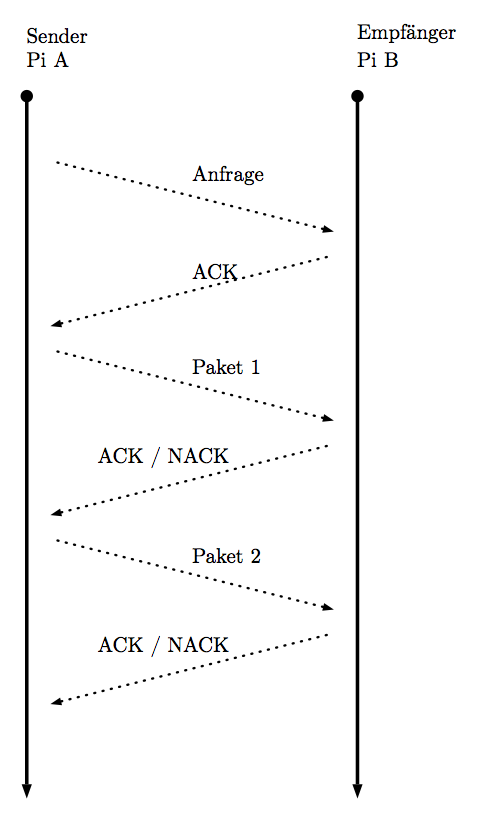

# Morsecode
Morsecode mit dem Raspberry Pi senden und empfangen

Schülerinnen und Schüler können mit dem Programm erfahren, wie der Kommunikationsaustausch mit dem Morsecode funktioniert. So können Unterrichtsinhalte zur 
* Kodierung
* Ziele der Kommunikation
* Paketbasierte Kommunikation
* Protokollbasierte Kommunikation (angelehnt an TCP/IP: Aufbau, Checksummen, Paketreihenfolge)
* Verschlüsselung / sicherer Kommunikationsaustausch

umgesetzt werden. Derzeit funktioniert der Kommunikationsaustausch nur unidirektional (Pi A sendet etwas an Pi B, Pi B sendet ACKs / NACKs zur Bestätigung / Ablehnung der Pakete). Diese Entscheidung wurde aus Gründen der Komplexität getroffen.

## Voraussetzungen
Es sind nur wenige Voraussetzungen nötig. Python ist bereits installiert.

### Hardware

* Zwei Raspberry Pis 
* Auf beiden Seiten: 
  * Diode zum Blinken (angeschlossen am Steckbrett)
  * Phototransistor zum Empfangen (angeschlossen am Steckbrett)

### Einstellungen des Programms

In der Datei `pi_a/config_pins.py` (bzw.  `pi_b/config_pins.py`) muss auf beiden Seiten der Pin für Diode (*senden*) und Phototransistor (*empfangen*) eingestellt werden.

## Starten

Am Raspberry Pi müssen dafür die Python-Dateien installiert werden. Dann erfolgt der Aufruf des Programms durch

    python main.py
    
Es zeigt sich das folgende Fenster.

## Abstand der Pis testen

Mit dem Skript `test_abstand/abstandstest.py` kann der Abstand der Pis angepasst werden (zuvor Pins in `test_abstand/config_pins_abstand.py` einstellen!), sodass die Kommunikation funktioniert. In der Praxis ist ein Abstand von 4 bis 5 cm möglich (je nach Helligkeit der Dioden).

## Beispiel

Weitere Erklärungen finden sich in der Datei `readme/programmablauf_bebildert/ablauf.pdf`.

## Erklärungen

Ein paar kurze Erklärungen. Weitere Erklärungen sind dem Quelltext zu entnehmen. 

### Zeichen

| Morsezeichen 	| Bedeutung | 
|-----------------	| ---------|
|`-`   | LANG, DASH|
|`.`   | KURZ, DOT |
|`#`   | Trennung zwischen Buchstaben |
|`\`   | Trennung zwischen Wörtern (Leerzeichen) |

### Sonderzeichen

| Sonderzeichen 	| Bedeutung | 
|-----------------	| ---------|
|`-.-.-`   | Verbindungsaufbau|
|`...-.`   | Bestätigung ACK |
|`...-.`   | Bestätigung ACK |
|`........`| Fehler, keine Bestätigung, NACK |

### Pakete

* maximal 7 Pakete können verschickt werden
  * die ersten 3 Bits eines Paketes bilden die Nummer des Paketes (binär kodiert, die Nummerierung der Pakete beginnt mit 1)
  * dann folgen die Daten-Bits
  * das letzte Bit ist ein Bit für die Checksumme (`-` für eine gerade Anzahl, `.` für eine ungerade Anzahl an DOTS, also `.`)
* weitere Infos: Im Quelltext `morsecode_to_packages.py`.

### Kommunikation

Die Kommunikation läuft in etwa so ab:

## Lizenz / License

Alle Dateien in diesem Repository steht unter einer *Namensnennung -- Nicht-kommerziell -- Weitergabe unter gleichen Bedingungen 4.0 International*-Lizenz. Die Bedingungen der Lizenz können unter folgendem Link eingesehen werden: [http://creativecommons.org/licenses/by-nc-sa/4.0/deed.de](http://creativecommons.org/licenses/by-nc-sa/4.0/deed.de)

### Autoren:

* Heiner Stroick
* Tim Vormann

## Weitere Informationen

Diese Arbeit entstand in einem Seminar zum Raspberry Pi an der TU Dortmund im Sommersemester 2016.